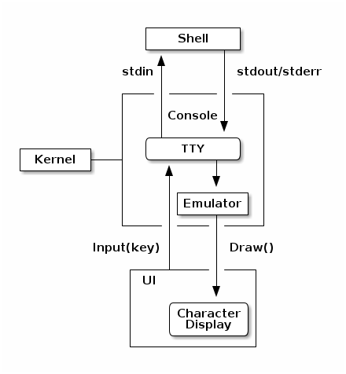

# Black Box OS

WebAssembly based OS in browser.



## Testing on Local Machine

Build kernel, and httpd and create filesystem:

```
$ make
cd kernel; GOOS=js GOARCH=wasm go build -o ../wasm/kernel.wasm
cd httpd; go build -o httpd
rsync -av sample/fs/.backup/* wasm/fs
building file list ... done

sent 961 bytes  received 20 bytes  1962.00 bytes/sec
total size is 6145  speedup is 6.26
```

Start httpd:

```
$ cd httpd
$ ./httpd -d ../wasm
2021/01/30 08:45:14 Serving ../wasm on HTTP: localhost:8100
```

Open Black Box terminal at http://localhost:8100/

## TODO

 - [X] Kernel in main frame, all other processes at Web Workers
 - [ ] CharDisplay interface
 - [ ] WebAuthn
